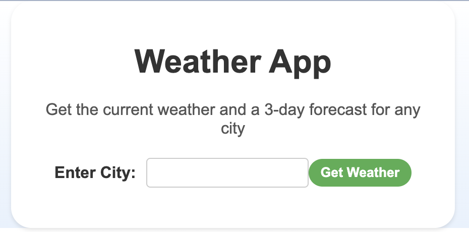
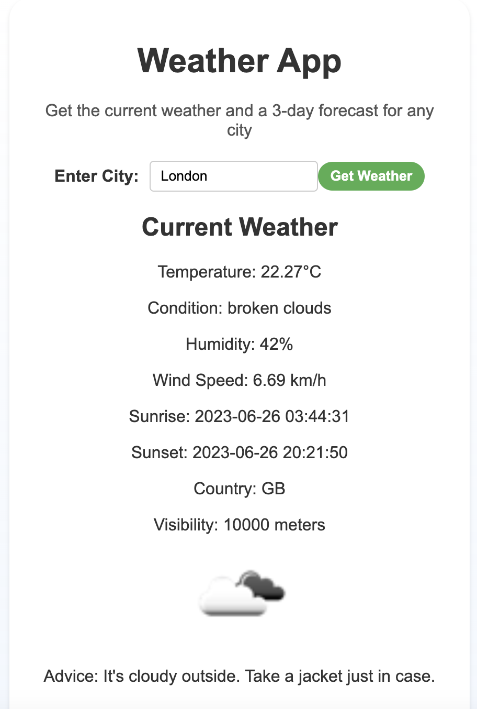
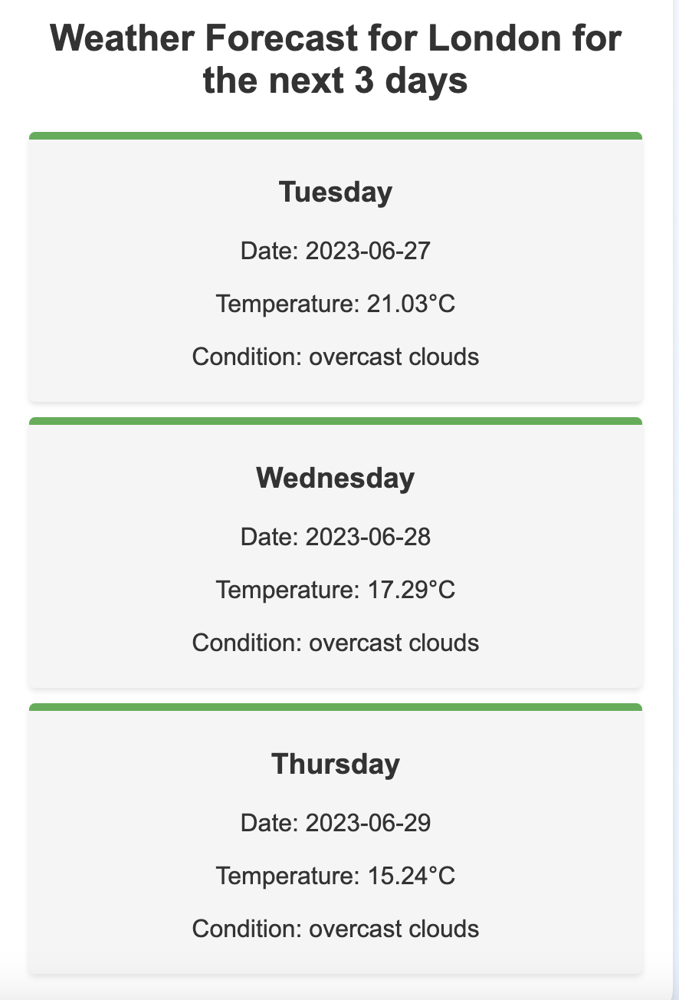

# Weather Forecast Flask App with Docker, Ansible, and GitHub Actions

This repository contains a simple, scalable Flask application that provides a weather forecasting service by leveraging the OpenWeatherMAP API. This application follows best practices for real-world industrial applications, including the usage of Docker for containerization, Ansible for configuration management, Prometheus and Grafana for monitoring and visualization and GitHub Actions for Continuous Integration and Continuous Deployment (CI/CD).

## About the Application

The Flask application in this project is a web-based weather forecasting application. It provides the current weather and a 3-day forecast for any city based on user input. The application fetches this information from the OpenWeatherMAP API and presents it to the user in an easily digestible format. Additionally, it offers advice based on the current weather conditions.

The application has been designed with scalability in mind, making it suitable for expansion into more complex applications. It also integrates Prometheus for monitoring the application metrics, providing valuable insights into the system performance.

## Project Structure

### `app.py`
This is the primary Flask application file where your application code resides.

### `test_app.py`
This is the test file for the application, it uses pytest library to run intergrated test.

### `requirements.txt`
This file contains the list of Python packages that your application depends on. They're installed inside the Docker container.

### `Dockerfile`
This file describes the build process for the Docker image of the application. It begins with a Python base image, sets a working directory, copies the application code, and installs the Python dependencies.

### `Ansible/`
This directory contains the Ansible playbook that manages the deployment of the Docker container on the target EC2 instances. The playbook takes care of installing necessary packages, adding the Docker repository, installing Docker and Docker Compose, pulling the Docker image from Docker Hub, and running the Docker container.

### `.github/workflows/`
This directory contains the GitHub Actions workflow files. There are two workflows, one for the `development` branch and one for the `master` branch.

## Requirements 

`Python >= 3.8`  
`pip`  
`flask`  
`requests`  
`pytest`  
`prometheus_flask_exporter`

## Docker

Docker is used to create a container for the Flask application. This ensures that the application runs in the same environment, regardless of where the Docker container is deployed. The `Dockerfile` in the root directory describes how to build the Docker image for the application.

## Ansible

Ansible is an automation tool that simplifies complex deployment tasks. The Ansible playbook (`Ansible/deploy.yml`) in this project automates the process of setting up Docker and Docker Compose on the target EC2 instances, pulling the Docker image from Docker Hub, and running the Docker container with the Flask application.

## GitHub Actions CI/CD

GitHub Actions is used to create a CI/CD pipeline for the Flask application. This pipeline automatically checks, tests, builds, and deploys the application whenever changes are pushed to the GitHub repository.

### `development.yml`

This workflow is triggered when changes are pushed to the `development` branch. The workflow:

1. Checks out the repository
2. Sets up Python 3.11
3. Installs the Python package dependencies
4. Runs tests using pytest
5. Logs in to Docker Hub
6. Builds and pushes the Docker image to Docker Hub
7. Validates the Ansible playbook with ansible-lint
8. Deploys the Docker container on the staging server using Ansible

### `production.yml`

This workflow is triggered when changes are pushed or a pull request is made to the `master` branch. The workflow performs the same steps as the `development.yml` workflow, but deploys the Docker container on the production servers.

## Running Tests

The GitHub Actions workflow is set up to automatically run tests when code is pushed to the repository. 
If you wish to run tests locally, ensure you have the necessary testing libraries installed, then run:
`$ python pytest test_app.py`

## Metrics

This application uses the Prometheus Flask exporter to expose metrics about the Flask application. You can access these metrics at the /metrics endpoint.

## Usage

1. Clone this repository.
2. Make sure Docker, Ansible, and Python are installed on your machine.
3. Set up the required secrets in your GitHub repository. This includes the Docker Hub username and password, the Ansible inventory, the SSH key, and the known hosts.
4. Push changes to the `development` or `master` branch. This triggers the corresponding GitHub Actions workflow, which tests, builds, and deploys the Flask application.

## Contributing

I welcome contributions to this project. Please feel free to open an issue or submit a pull request.

## License

This project is licensed under the terms of the MIT license. It means you are free to use, modify, and distribute the project under the conditions specified in the license.

## Project UI

### Before User input city

### When User Input City

### Forecast for the Next 3 Days of the City

